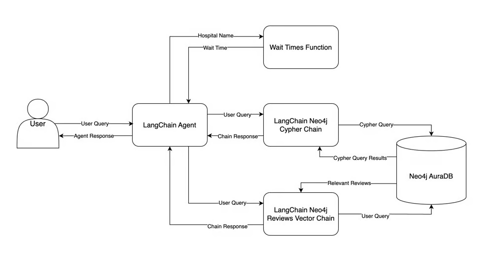

# **Hospital RAG Chatbot**

This repo is based on the tutorial : `Build an LLM RAG Chatbot With LangChain by Harrison Hoffman`

## **Overview**

This project implements a Retrieval-Augmented Generation (RAG) chatbot designed to interact with a Neo4j graph database containing hospital-related data. The chatbot is built using LangChain, a framework that simplifies the creation of applications powered by large language models (LLMs). The frontend is developed using Streamlit, providing a user-friendly interface for querying hospital data.

## **Features**

- **Natural Language Queries**: Users can interact with the chatbot using natural language to retrieve information about hospitals, such as wait times, patient reviews, billing details, and more.
- **Neo4j Graph Database Integration**: The project uses a Neo4j graph database to store and query hospital data, enabling complex relationship-based queries.
- **Streamlit Frontend**: A simple and interactive frontend for the chatbot, allowing users to ask questions and receive answers in real-time.
- **Asynchronous API Calls**: The system supports bulk asynchronous requests, ensuring efficient handling of multiple queries simultaneously.

## **Project Structure**

```plaintext
├── chatbot_api
│   ├── Dockerfile
│   ├── main.py
│   ├── agents
│   │   ├── hospital_rag_agent.py
│   │   └── ...
│   └── ...
├── chatbot_frontend
│   ├── Dockerfile
│   ├── app.py
│   └── ...
├── hospital_neo4j_etl
│   ├── Dockerfile
│   ├── etl.py
│   └── ...
├── tests
│   ├── async_agent_requests.py
│   └── ...
├── docker-compose.yml
└── README.md
```

- **`chatbot_api/`**: Contains the backend API logic, including agents, tools, and API endpoints.
- **`chatbot_frontend/`**: Contains the Streamlit-based frontend code.
- **`hospital_neo4j_etl/`**: Contains scripts and logic for extracting, transforming, and loading (ETL) data into the Neo4j database.
- **`tests/`**: Contains test scripts for verifying the functionality of the chatbot and API.

## **Setup and Installation**

### **Prerequisites**

- **Docker** and **Docker Compose** installed on your machine.
- **Python 3.10** or higher (if running outside of Docker).
- **Neo4j** instance for the graph database.

### **Step 1: Clone the Repository**

```bash
git clone https://github.com/yourusername/hospital-rag-chatbot.git
cd hospital-rag-chatbot
```

### **Step 2: Configure Environment Variables**

Create a `.env` file in the root directory and add the necessary environment variables:

```plaintext
NEO4J_URI=bolt://neo4j:7687
NEO4J_USER=neo4j
NEO4J_PASSWORD=your_neo4j_password
HUGGINGFACEHUB_API_TOKEN=your_huggingface_api_token
```

### **Step 3: Build and Run the Docker Containers**

Use Docker Compose to build and run the services:

```bash
docker-compose up --build
```

This command will build and start the following services:

- **hospital_neo4j_etl**: Loads the Neo4j database with hospital data.
- **chatbot_api**: Runs the backend API service.
- **chatbot_frontend**: Serves the Streamlit frontend interface.

### **Step 4: Access the Frontend**

Once the containers are running, you can access the Streamlit frontend by navigating to `http://localhost:8501` in your web browser.

## **Usage**

### **Querying the Chatbot**

- **Ask Questions**: Use the Streamlit interface to ask natural language questions related to hospital data.
- **Example Queries**:
  - "What is the current wait time at Wallace-Hamilton hospital?"
  - "Which hospital has the shortest wait time?"
  - "What are patients saying about the nursing staff at Castaneda-Hardy?"

### **Running Tests**

You can run the test scripts to verify the chatbot's functionality:

```bash
python -m unittest discover tests/
```


## Chatbot Design



**LangChain Agent**: The LangChain agent is the brain of your chatbot. Given a user query, the agent decides which tool to call and what to give the tool as input. The agent then observes the tool’s output and decides what to return to the user—this is the agent’s response.  
**Neo4j AuraDB**: Stores both structured hospital system data and patient reviews in a Neo4j AuraDB graph database.   
**LangChain Neo4j Cypher Chain**: This chain tries to convert the user query into Cypher, Neo4j’s query language, and execute the Cypher query in Neo4j. The chain then answers the user query using the Cypher query results. The chain’s response is fed back to the LangChain agent and sent to the user.  
**LangChain Neo4j Reviews Vector Chain**: The chain searches for relevant reviews based on those semantically similar to the user query, and the reviews are used to answer the user query.  
**Wait Times Function**: The hospital name is passed as input to a Python function that gets wait times, and the wait time is returned to the agent.  

